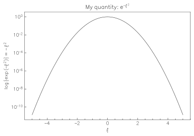
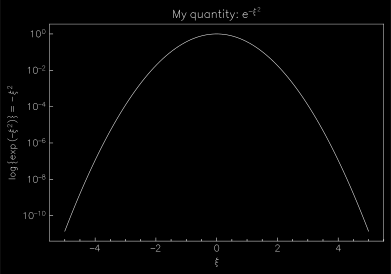

# Hershey font adapted for usage in plotting

Classical font developed by Dr. Allen V. Hershey in 1967 for usage in early-day computers adapted to modern `otf` format. This adaptation of the font makes it possible to use it in the scientific plotting environments, such as `matplotlib` (see `example/plot.py` for an example).

#### Light plot example

#### Dark plot example

### Links
* [Hershey font in the "Fonts in use" catalog](https://fontsinuse.com/typefaces/46757/hershey-fonts)
* [Unofficial documentation of the Hershey font standard](http://paulbourke.net/dataformats/hershey/)
* [Linux library for the Hershey vector font](http://www.whence.com/hershey-fonts/)
* [Adapted instruction files in `.jhf` format](https://emergent.unpythonic.net/software/hershey)
* [Some background history on the font](https://hackaday.com/2021/03/30/hershey-fonts-not-chocolate-the-origin-of-vector-lettering/)
* [Font has been widely used and popularized in the scientific community by the IDL software](https://www.l3harrisgeospatial.com/docs/Using_Hershey_Vector_Fon.html)
* [`myplotlib` -- a `matplotlib` binder library with custom styles including one based on the Hershey font](https://github.com/haykh/myplotlib)
* [Other github projects acknowledging the awesomeness of the Hershey font style](https://github.com/topics/hershey-fonts)